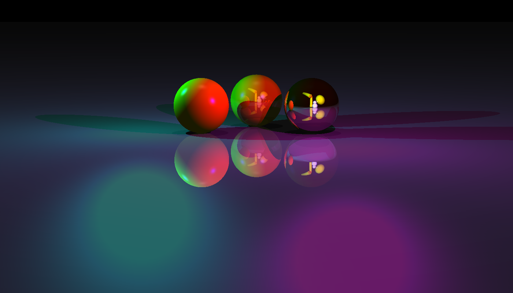

#  miniRT — Mini Ray Tracer engine

> A ray tracer written in C from scratch, built as a 42 School project.




---

##  About

**miniRT** is a ray tracer built in pure C using the MiniLibX graphics library. It renders 3D scenes described in `.rt` files, supporting multiple geometric primitives, lighting models, shadows, and reflections.

Beyond the mandatory subject requirements, this implementation includes a full **interactive editor** with real-time preview rendering, allowing users to move the camera, add/remove objects, edit colors, adjust reflectivity, and save scenes — all from within the window.

---

##  What is Ray Tracing?

Ray tracing is a rendering technique that simulates how light physically behaves in a scene. Instead of rasterizing geometry, it works **backwards**, for each pixel on the screen, a ray is cast from the camera into the scene. If the ray hits an object, the renderer calculates:

1. **What hit?** — intersection tests are performed against every primitive (sphere, plane, cylinder, triangle)
2. **What color is it?** — the surface material and color are retrieved
3. **Is it lit?** — a secondary shadow ray is cast toward each light source; if blocked, the point is in shadow
4. **How does it look?** — the final color is computed using ambient, diffuse, and specular components
5. **Does it reflect?** — if the surface has reflectivity > 0, a new reflected ray is cast recursively

This process naturally produces effects like **hard shadows**, **specular highlights**, and **mirror-like reflections** that are difficult or expensive to fake in rasterization pipelines. The tradeoff is that it is computationally heavy, which is why miniRT parallelizes rendering with threads.

---

---

##  Usage

```bash
make
./miniRT                                      # Opens scene selector menu
./miniRT <scene.rt>                           # Render a scene file
./miniRT <scene.rt> --lowRender               # Render in preview (edit) mode
./miniRT --help                               # Show usage
./miniRT --commands                           # Show all keyboard commands
./miniRT --demo                               # Run demo showcase
```

---

##  Supported Primitives

| Shape | Identifier |
|-------|------------|
| Sphere | `sp` |
| Plane | `pl` |
| Cylinder | `cy` |
| Triangle | `tr` |

---

##  Lighting Model

The renderer uses a classic **Phong shading model** combining:

- **Ambient light** — global base illumination, configurable ratio and color
- **Diffuse lighting** — based on the angle between the surface normal and the light direction
- **Specular highlights** — Blinn-Phong reflection with configurable shininess
- **Multiple lights** — unlimited point lights per scene
- **Hard shadows** — shadow rays are cast for each light to check occlusion

---

## 🪞 Reflections

Objects support a `reflectivity` value between `0.0` and `1.0`. Reflected rays are traced recursively up to a configurable depth (`DEPTH = 3`), with the final color blended between the local shading and the reflected color based on the reflectivity coefficient.

---

##  Performance

Rendering is parallelized using **POSIX threads** (`pthreads`). The image is split into horizontal bands, each processed by a separate thread (`THREAD_COUNT` configurable). This applies to both the full render and the real-time preview.

---

## 🖥️ Interactive Editor (Preview Mode)

Enable with `--lowRender` or press `SPACE` in a running scene. In this mode the scene re-renders in real time at reduced resolution (4×4 pixel blocks), making interaction fluid.

### General

| Key | Action |
|-----|--------|
| `ESC` | Exit |
| `F1` | Return to scene menu |
| `SPACE` | Toggle preview / full render |
| `TAB` | Screenshot (saved to `screenshots/`) |
| `CAPSLOCK` | Save current scene to a `.rt` file |

### Camera (no object selected)

| Key | Action |
|-----|--------|
| `W / S` | Move forward / backward |
| `A / D` | Move left / right |
| `Q / E` | Move up / down |
| `↑ / ↓` | Rotate pitch |
| `← / →` | Rotate yaw |
| `Z / C` | Rotate roll |
| `Scroll` | Adjust FOV |

### Add Objects (no object selected)

| Key | Object Added |
|-----|-------------|
| `1` | Sphere |
| `2` | Cylinder |
| `3` | Triangle |
| `4` | Plane |
| `5` | Point Light |

### Edit Object (click to select)

| Key | Action |
|-----|--------|
| `W / S` | Move on Y axis |
| `A / D` | Move on X axis |
| `Scroll` | Move on Z axis |
| `↑ / ↓` | Rotate pitch |
| `← / →` | Rotate yaw |
| `Z / C` | Rotate roll |
| `J / K` | Decrease / increase size |
| `N / M` | Decrease / increase height (cylinder) |
| `I / O` | Decrease / increase reflectivity |
| `T` | Edit color (terminal prompt) |
| `+ / -` | Adjust edit sensitivity |
| `BACKSPACE` | Remove selected object |
| `Q` | Deselect |

### Lights

| Key | Action |
|-----|--------|
| `LEFT SHIFT` | Toggle light edit mode |
| `[ / ]` | Select previous / next light |
| `P` | Set light position (terminal prompt) |
| `J / K` | Decrease / increase intensity |
| `T` | Edit light color (terminal prompt) |

---

##  Scene File Format (`.rt`)

```
# Camera
C x,y,z   nx,ny,nz   fov

# Ambient Light
A ratio   r,g,b

# Point Light
L x,y,z   ratio   r,g,b

# Sphere
sp x,y,z   diameter   r,g,b   [reflectivity]

# Plane
pl x,y,z   nx,ny,nz   r,g,b   [reflectivity]

# Cylinder
cy x,y,z   nx,ny,nz   diameter height   r,g,b   [reflectivity]

# Triangle
tr ax,ay,az   bx,by,bz   cx,cy,cz   r,g,b   [reflectivity]
```

Reflectivity is optional (0.0–1.0). Lines starting with `#` are treated as comments.

---

##  Screenshots

Screenshots are saved automatically to the `screenshots/` folder and named sequentially (`screenshot_0000.ppm`, `screenshot_0001.ppm`, …).

---

##  Scene Selector Menu

Running `./miniRT` without arguments opens a graphical scene selector that lists all `.rt` files from the `scenes/` directory. Use the arrow keys to navigate, `+ / -` to switch between **DEFAULT** and **EDIT** (low render) modes, and `ENTER` to launch.

---

##  Animations

miniRT supports two animation modes, both driven by an `update_scene()` function called each frame that mutates the scene state before re-rendering.

### `--animate` mode

```bash
./miniRT <scene.rt> --animate
```

Renders continuously in a loop at real-time speed. The scene updates every frame (at ~24 fps delta), making objects move, rotate, or change dynamically. Ideal for previewing animations interactively.

### `--frames` mode

```bash
./miniRT <scene.rt> --frames <first> <last>
```

Renders a range of frames offline and saves each one as a `.ppm` image inside the `frames/` folder (`frame_0000.ppm`, `frame_0001.ppm`, …). This allows exporting animation sequences that can then be compiled into a video with tools like `ffmpeg`:

```bash
ffmpeg -framerate 24 -i frames/frame_%04d.ppm -c:v libx264 output.mp4
```

### How animations work internally

Each frame, `update_time()` advances a global timer by a fixed delta of `1/24` seconds:

```c
void update_time(t_scene *sc)
{
    sc->time.delta = 1.0 / 24.0;
    sc->time.current += sc->time.delta;
}
```

Then `update_scene()` uses this timer to drive object transformations and recomputes the camera:

```c
void update_scene(t_scene *sc)
{
    update_time(sc);

    // uncomment the animation you want to run:
    // update_diamond_rotation(sc);
    // update_rain(sc);
    // update_billiard(sc);
    // update_falling_sphere(sc);
    // update_anim_spheres(sc);
    update_dragon(sc);

    sc->camera->camdata = ft_compute_camera(*sc->camera, WIDTH, HEIGHT);
}
```

Each animation function directly mutates objects inside `sc->objects[]`. For example, `update_falling_sphere` applies gravity and bounce physics to a sphere by reading and writing its center position each frame:

```c
void update_falling_sphere(t_scene *sc)
{
    t_sphere *sp = (t_sphere *)sc->objects[0]->data;
    double dt = 1.0 / 24.0;

    velocity += -10.0 * dt;       // gravity
    sp->center.y += velocity * dt; // move

    // bounce on the ground
    if (sp->center.y - (sp->diameter / 2) <= -0.5)
    {
        sp->center.y = -0.5 + (sp->diameter / 2);
        velocity = -velocity * 0.65; // damping
    }
}
```

And `update_diamond_rotation` rotates all triangles of a diamond shape around a center point using `cos`/`sin` driven by `sc->time.current`:

```c
angle = sc->time.current * 2.0 * M_PI / 15.0; // full rotation every 15s
cos_a = cos(angle);
sin_a = sin(angle);

// for each triangle vertex:
tr->a.x = center.x + (offset.x * cos_a - offset.z * sin_a);
tr->a.z = center.z + (offset.x * sin_a + offset.z * cos_a);
```

### Adding your own animation

To create a new animation, write a function that modifies any objects in `sc->objects[]` or lights in `sc->lights[]`, then call it inside `update_scene()`. Any geometric property, position, size, rotation axis, color, can be changed each frame.

---

##  Dependencies

- [MiniLibX](https://github.com/42Paris/minilibx-linux) — window/image management

---

##  Author

**Leandro Gertrudes**  
[github.com/leandro-gertrudes](https://github.com/leandro-gertrudes)
